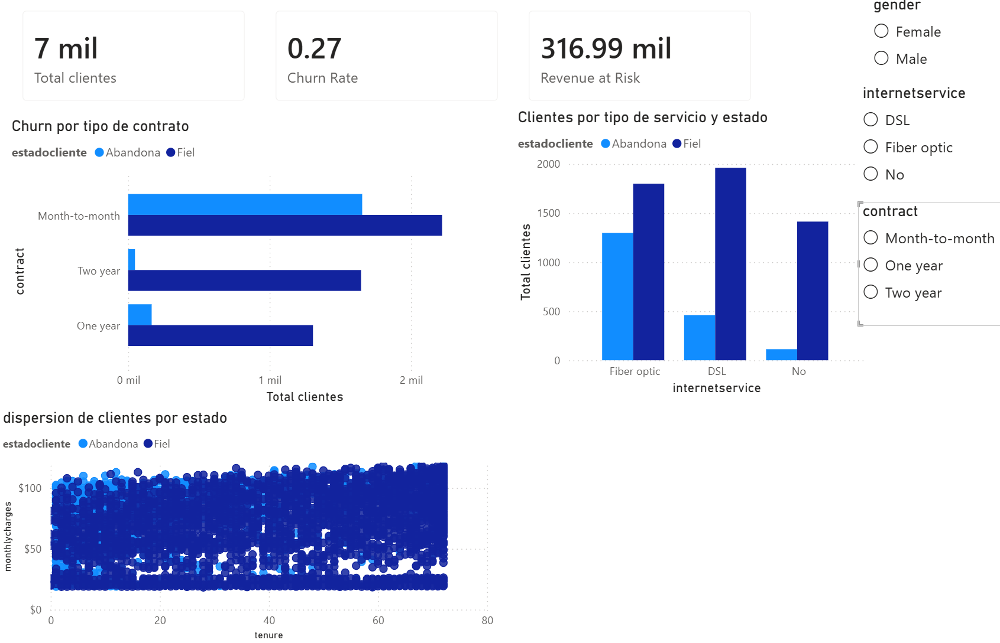
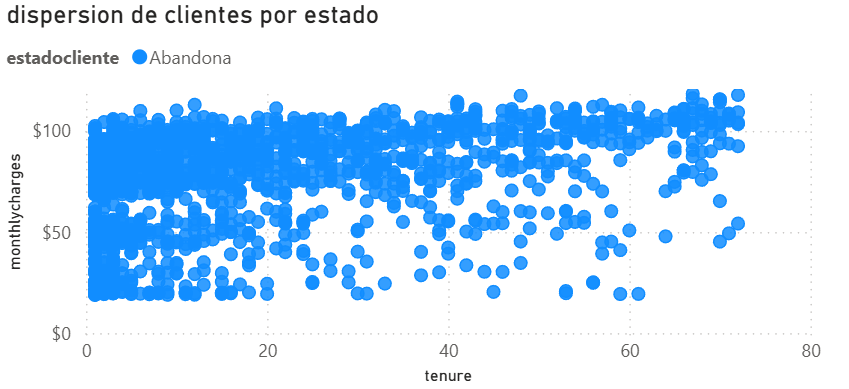

# Saas-Customer-Churn-Analysis
Proyecto end-to-end de análisis de retención de clientes usando Python, SQL y Power BI
# 📊 Análisis de Retención de Clientes (SaaS Churn)

Este proyecto presenta un ecosistema de datos completo para identificar por qué los clientes abandonan el servicio, utilizando un enfoque estadístico y visual.

## 📁 Estructura del Proyecto
* **`/notebooks`**: Limpieza de datos y validación de hipótesis (T-Test) en Python.
* **`/sql`**: Modelado de base de datos y consultas avanzadas en PostgreSQL.
* **`/dashboard`**: Reporte interactivo en Power BI y capturas de resultados.

---

## 📈 Visualización de Resultados

### 1. Dashboard Ejecutivo
Se diseñó un panel central para monitorear el Churn Rate y el ingreso en riesgo (Revenue at Risk).

### 2. Análisis de Riesgo (Insight Maestro)
El gráfico de dispersión confirma que los clientes con **altos cargos mensuales y baja antigüedad** son el segmento con mayor probabilidad de fuga.

---

## 💡 Conclusiones Técnicas
1. **Validación Estadística**: Mediante un T-Test en Python, se confirmó que existe una diferencia significativa en los cargos de los clientes que se van vs. los que se quedan.
2. **SQL de Valor**: Se utilizaron *Window Functions* para rankear a los clientes por costo dentro de sus contratos, permitiendo priorizar esfuerzos de retención.
3. **Recomendación**: La empresa debe enfocar sus campañas de fidelización en clientes de "Fibra Óptica" con contratos mensuales, ya que presentan un 30% más de churn.

---

## 📥 Cómo ver el reporte
Si tienes Power BI Desktop, puedes [descargar el archivo .pbix aquí](Dashboard_Churn.pbix).
